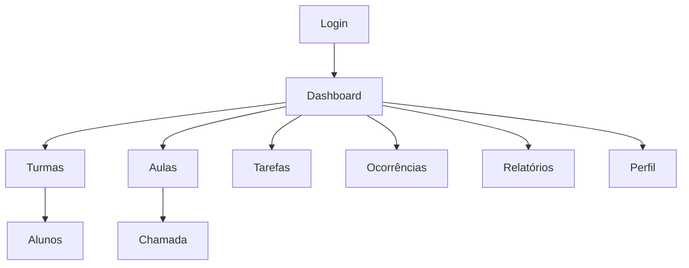

# Aula 1 — **Mobile‑First + Escopo UX do SGSA**

> **Objetivo da aula:** Introduzir o conceito de *mobile‑first* e construir os artefatos iniciais de UX do SGSA: **personas, user stories, sitemap e wireframes de baixa fidelidade** das telas principais.

**Pré‑requisitos:** Noções básicas de HTML/CSS e disposição para rabiscar (papel, caneta ou ferramenta digital como Figma/Miro/Draw.io). Não é necessário saber Bootstrap ainda.

------

## 1) Resultados de Aprendizagem (Ao final, o aluno será capaz de…)

- Explicar, com exemplos, o que é **mobile‑first** e por que ele reduz retrabalho.
- Definir o **escopo funcional** mínimo do SGSA com base em personas e user stories.
- Mapear a navegação principal em um **sitemap** claro e coerente.
- Produzir **wireframes de baixa fidelidade** para: Login, Dashboard, Turmas, Alunos, Aulas, Chamada, Tarefas, Ocorrências, Relatórios e Perfil.
- Aplicar **boas práticas iniciais de acessibilidade** (hierarquia de títulos, contraste, rótulos de formulário, foco).

------

## 2) Conceitos‑chave — Mobile‑First (com exemplos)

**O que é:** projetar **primeiro para telas pequenas**, garantindo que o essencial funcione bem no celular; depois, **progredir** para telas médias e grandes.

**Por quê:** performance, foco no essencial, acessibilidade e menor retrabalho.

### Exemplo prático (HTML + CSS mobile‑first, usando paleta do projeto)

```html
<!DOCTYPE html>
<html lang="pt-BR">
<head>
  <meta charset="utf-8">
  <meta name="viewport" content="width=device-width, initial-scale=1">
  <title>SGSA — Protótipo</title>
  <style>
    :root {
      --roxo-escuro: #420950;
      --roxo-profundo: #380047;
      --roxo-base: #682278;
      --lilas: #9E67AD;
      --verde: #1E4E05;
      --roxo-secundario: #37234F;
    }

    body {
      font-family: system-ui, sans-serif;
      margin: 0;
      background-color: var(--roxo-escuro);
      color: #fff;
    }

    header {
      background: var(--roxo-profundo);
      padding: 16px;
      text-align: center;
    }

    .kpis { display: grid; gap: 12px; padding: 16px; }
    .kpi {
      padding: 16px;
      border-radius: 8px;
      text-align: center;
      background: var(--roxo-base);
    }

    .kpi.critico { background: var(--verde); color: #fff; }

    @media (min-width: 768px) {
      .kpis { grid-template-columns: repeat(2, 1fr); }
    }
    @media (min-width: 1200px) {
      .kpis { grid-template-columns: repeat(4, 1fr); }
    }
  </style>
</head>
<body>
  <header>
    <h1 class="h4">SGSA</h1>
  </header>
  <main>
    <section aria-labelledby="titulo-dashboard">
      <h2 id="titulo-dashboard">Dashboard</h2>
      <div class="kpis">
        <div class="kpi">Turmas</div>
        <div class="kpi">Alunos</div>
        <div class="kpi">Ocorrências</div>
        <div class="kpi critico">Frequência</div>
      </div>
    </section>
  </main>
</body>
</html>
```

**Comentários:**

- A **paleta do projeto** já está aplicada como variáveis CSS (`:root`).
- `meta viewport` garante escala correta no mobile.
- **Mobile é o padrão**: grid simples; media queries adicionam colunas conforme a tela cresce.
- Hierarquia semântica (`h1`, `h2`) ajuda leitores de tela e SEO.

------

## 3) SGSA — Contexto, Personas e User Stories

### Contexto resumido

O SGSA é um sistema para **gestão de sala de aula** com foco em professores e coordenação. Fluxos principais: gerenciar turmas, alunos, aulas, chamadas, tarefas e ocorrências; extrair relatórios; ajustar perfil.

### Personas (modelo rápido)

- **Prof. Ana (principal):** ministra várias turmas; precisa registrar **chamada** rapidamente e lançar **tarefas/ocorrências**.
- **Coord. Bruno:** acompanha **relatórios** (frequência/ocorrências) e indicadores no **dashboard**.
- **Aluno/Responsável (futuro):** consulta tarefas e presença (fora do escopo imediato do M1, mas útil para visão).

### User Stories (modelo)

Formato: `Como <tipo de usuário>, quero <ação> para <benefício>`

Exemplos iniciais:

- *Como **professor**, quero marcar presença P/F/A em menos de 30s para não atrasar a aula.*
- *Como **professor**, quero registrar uma ocorrência com 2 toques para não perder o contexto.*
- *Como **coordenador**, quero ver **KPIs** de frequência e ocorrências por turma para agir rapidamente.*

------

## 4) Escopo do Mínimo Viável (MVP) por Tela

- **Login:** e‑mail/senha, botão Entrar, link “Esqueci a senha”.
- **Dashboard:** 4 KPIs (turmas, alunos, ocorrências, frequência); links para áreas; estado vazio amigável.
- **Turmas:** lista (nome, série, turno), busca/filtro simples.
- **Alunos:** lista por turma (nome, matrícula, status); campo de busca.
- **Aulas:** lista cronológica; botão “Abrir Chamada”.
- **Chamada:** lista de alunos com **toggle P/F/A** acessível, salvar rascunho.
- **Tarefas:** lista + “Nova tarefa” (título, descrição, data).
- **Ocorrências:** lista + “Nova ocorrência” (aluno, tipo, descrição breve).
- **Relatórios:** filtros mínimos (turma/período), tabela simples; botão Exportar (CSV fake) e Imprimir.
- **Perfil:** nome, e‑mail, alterar senha; sair.

------

## 5) Sitemap (mapa de navegação)



------

## 6) Wireframes de Baixa Fidelidade (passo a passo)

- **Login:** logo minimal, campos e‑mail/senha (com *label*), botão Entrar.
- **Dashboard:** 4 cartões KPI (número + rótulo), lista “Ações rápidas”.
- **Turmas:** busca, lista de cards (nome + badge de turno + botão ver).
- **Alunos:** lista com nome + avatar/letra + status.
- **Aulas:** lista por data/hora; CTA “Abrir chamada”.
- **Chamada:** cabeçalho (turma/data), linhas com aluno e **3 opções P/F/A**.
- **Tarefas:** lista (título, prazo, status) + botão “Nova”.
- **Ocorrências:** lista (aluno, tipo, data) + botão “Nova”.
- **Relatórios:** filtros simples no topo; tabela; botões Exportar/Imprimir.
- **Perfil:** dados do usuário; botões alterar senha e sair.

------

## 7) Acessibilidade (A11y) — Regras iniciais

- **Títulos hierárquicos** (h1 > h2 > h3).
- **Labels** associados a campos.
- **Foco visível** em elementos interativos.
- **Contraste** suficiente (paleta escolhida tem tons escuros e claros que devem ser aplicados com cuidado).
- **Alvos de toque**: mínimo **44×44 px**.

------

## 8) Entregáveis da Aula 1

1. **Persona principal** (professor).
2. **3 user stories** alinhadas à persona.
3. **Sitemap** do SGSA.
4. **Wireframes low‑fi** das 10 telas.

------

## 9) Rubrica de Avaliação (0–3)

- **3 — Excelente:** Persona clara; 3+ stories específicas; sitemap coerente; 10 wireframes com foco em tarefa, estados e A11y básico.
- **2 — Bom:** Persona ok; 3 stories; sitemap com pequenas lacunas; ≥8 wireframes consistentes.
- **1 — Básico:** Persona superficial; ≤2 stories genéricas; sitemap confuso; ≤6 wireframes incompletos.
- **0 — Insuficiente:** Entregas ausentes ou incoerentes.

------

## 10) Próximos Passos (para Aula 2)

- Converter os wireframes em **estrutura HTML** usando **Bootstrap via CDN**.
- Criar **tokens de design** (cores, tipografia, espaçamentos) baseados na **paleta do projeto** e aplicar ao layout base.